# tf_dcgan
A TensorFlow implementation of DC-GAN:

[Unsupervised Representation Learning with Deep Convolutional Generative Adversarial Networks](https://arxiv.org/pdf/1511.06434.pdf)

## Dataset
We will use celebA dataset in this implementation, please download it [here](http://mmlab.ie.cuhk.edu.hk/projects/CelebA.html)

Unzip the file, then

```bash
ls *.png > img_set.txt
```

And then delete the last line (which is the name of this txt file itself)

## Some Generated Examples (fixed noise)

(I used the wrong color channel order to save, it is actually BGR now)

<table><tr><td>
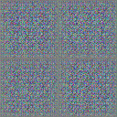
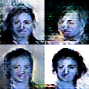
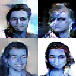
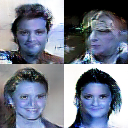<br>
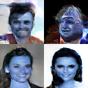
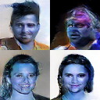
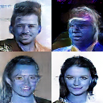
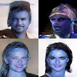<br>
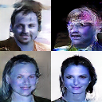
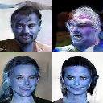
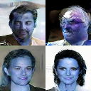
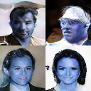
</td>
</table>

## Misc

Both generator loss and discriminator loss become `nan` in about 13th epoch. Not yet figured out why.

## Reference

THe PyTorch [example](https://github.com/pytorch/examples/blob/master/dcgan)